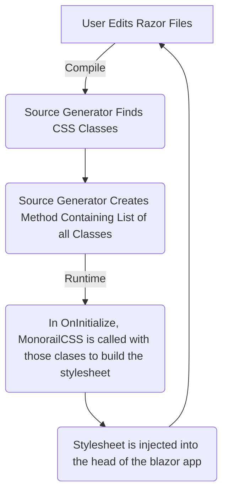

# MonorailCss.SourceGen.AspNet

`MonorailCss.SourceGen.AspNet` is a source generator to help discover in use CSS classes in an ASP.NET application for use with the MonorailCss.Framework library. 

**Here be dragons**: this is woefully incomplete and untested outside of the most simple scenarios. It will only work with static content from cshtml files. HTML files, dynamic setting of CSS classes and probably a decent amount of edge cases haven't even been considered yet. 

## Usage

Include razor or cshtml files in your csproj

```xml
<ItemGroup>
    <AdditionalFiles Include="**/*.razor" />
</ItemGroup>
```

Add a partial class named MonorailCss somewhere in your project. The source generator will add a new method named `CssClassValues()` to this method. This method can be used to call MonorailCSS to generate the CSS

```csharp
internal partial class MonorailCss
{
}
```

## What's Poppin


